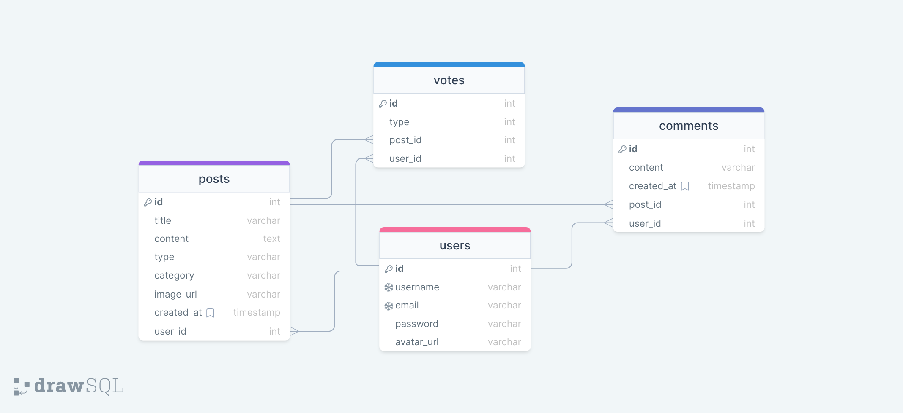

# Reddit-Yazeed
## Live Server [HERE](https://reddit-yazeed.herokuapp.com/)
---
## Description:

A humble try to clone reddit website as a training, I have done my best, I hope you will like it.
The website is supposed to give you ability to add posts and comments on posts that you like.
You can visit user profiles as well to see their posts and comments.
So give yourself a small journey through my website, I hope you like it.

---
## Databae Schema 



---
## User Stories:

- You can sign up and sign in.
- You can add posts as text or links.
- You can see your posts in your profile.
- You can comment on other posts.
- You can vote on the post you are interested in.
- You can visit others profiles
- You can filter posts by vote number or post date
- You can search for posts by title
- You can filter posts by category

---
##  How to install the project on the local machine

- You can click the _code_ drop-down menu as illustrated in the picture above and copy the link to clone the repo.
- Now go to your terminal and type: `git clone <the link here>` and then the repo will be cloned to your local machine.
- By now you have to open your IDE -I recommend VSCode- and open the project.
- Now you need to run the command `npm install` to install all the dependencies.
- After that you should setting up the database follow the steps :

    1.  Connect to postgres, by typing `psql` or `pgcli` in the terminal.
    2.  use these commands to create your database
        ```
        CREATE DATABASE db_name;
        CREATE USER user_name WITH SUPERUSER PASSWORD 'password';
        ALTER DATABASE db_name OWNER TO user_name;
        ```
    3.  Add a `.env` you can see ```example.env``` to get idea of what you need to write.
    4. Copy build.sql path ```.../server/database/config/build.sql``` and run this command in terminal ```\i [build.sql path]```.
- to open a live page from your local machine project, you can run the `npm run dev` command which will open a live server to work with.
- Happy Coding!

---
##  Technologies that I used

- -> HTML5.
- -> CSS3.
- -> JavaScript.
- -> Nodejs.
- -> Express.
- -> PLpgSQL.
- -> NPM.
- -> Git & GitHub.
- -> bcrypt
- -> jwt
- -> cookie parser

## This app is presented to you by:

- [Yazeed El-Haj Salem](https://github.com/ysalem-dev-89)
